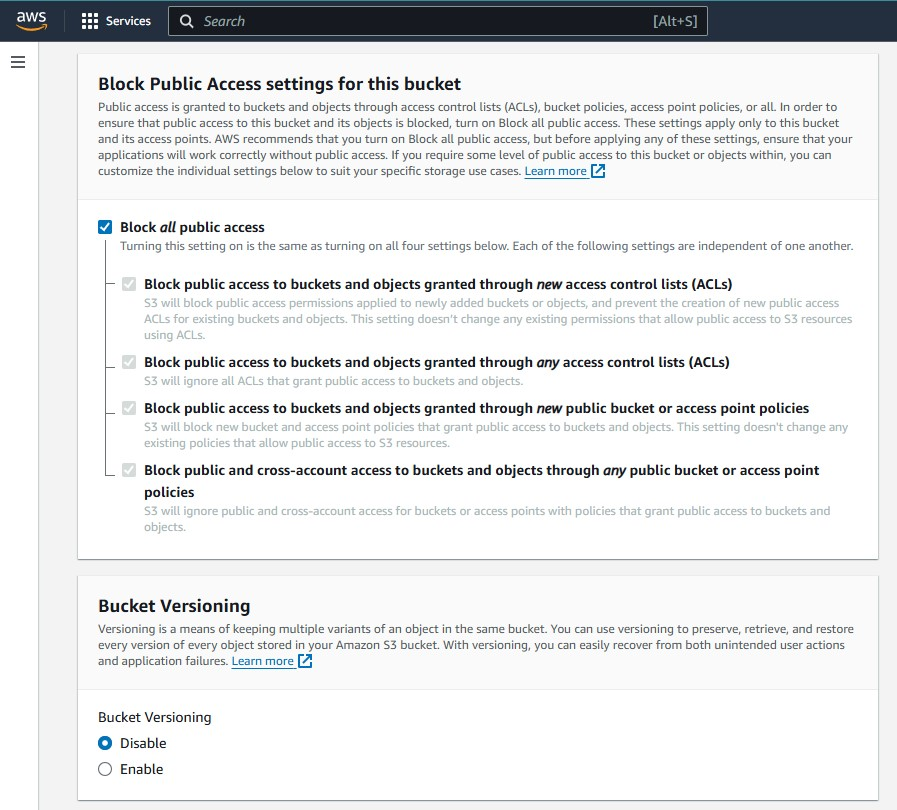

+++
title = "Tạo S3 Bucket và CloudFront"
date = 2024
weight = 1
chapter = false
pre = "<b>2.1. </b>"
+++

## NỘI DUNG
Ở bước này bao gồm tạo **S3 Bucket** và **CloudFront** distribution để có thể truy cập và sử dụng nội dung.
- [NỘI DUNG](#nội-dung)
    - [Tạo S3 Bucket](#tạo-s3-bucket)
    - [Tải lên và xem ảnh/tệp tin/thư mục](#tải-lên-và-xem-ảnhtệp-tinthư-mục)
    - [Tạo CloudFront](#tạo-cloudfront)

#### Tạo S3 Bucket

1. Trên thanh tìm kiếm, tìm kiếm S3 và nhấn chọn để vào màn hình console của dịch vụ S3 Bucket.

2. Nhấn vào **Create bucket** để tạo S3 Bucket mới.
3. Ở trang tạo S2 Bucket, điền tên Bucket muốn tạo và chọn ACLs disabled ở phần Object Ownership

{}
Tùy chọn ACLs (Access control list) disabled để cấu hình quyền sở hữu của tất cả các tệp, thư mục,... trong S3 Bucket đều là của tài khoản AWS này. Tất cả truy cập, chỉnh sửa đối với các object bên trong đều được quy định nhờ các **Policy** (IAM Policies and Permissions). Điều này làm tăng tính cá nhân, bảo mật, an toàn cho dữ liệu.
{}

4. Các mục **Public Access** và **Bucket Versioning** để cấu hình mặc định.

{}
Chặn các truy cập public đảm bảo bảo mật, chỉ tương tác thông qua **CloudFront**, **API** (có xác thực).
{}

5. Các mục **Tags**, **Default encryption (Mã hóa)** và **Advanced settings** để cấu hình mặc định

6. Nhấn **Create bucket**, S3 Bucket của bạn đã được tạo thành công.

#### Tải lên và xem ảnh/tệp tin/thư mục
1. Nhấn chọn nút **Upload**

2. Chọn **Add files/Add folder** tương ứng loại object mà bạn muốn tải lên và nhấn **Upload**

Upload thành công

3. Có thể xem nội dung (đối với ảnh), hoặc tải về bằng nút **Open**.

{}
Có thể xem/tải xuống bằng URL ở Object URL nếu bỏ tùy chọn Block Public Access tương ứng (Ở mục tạo Bucket).
{}

#### Tạo CloudFront
1. Trên thanh tìm kiếm, tìm kiếm CloudFront và nhấn chọn để vào giao diện của dịch vụ AWS CloudFront. Nhấn **Create distribution** để tạo Distribution mới.

2. Chọn Origin domain là domain của S3 Bucket đã tạo ở trên. Chọn OAC (Origin Access Control) tới S3 Bucket đã tạo.

*Nếu OAC chưa tồn tại thì nhấn Create new OAC để tạo mới.*

4. Các mục sau làm theo các bước dưới đây.

5. Nhấn **Create distribution** để khởi tạo.
6. Ở màn hình sau khởi tạo sẽ có hiện một cảnh, yêu cầu thêm policy để cấp quyền cho **CloudFront** có thể truy cập vào nội dung lưu trữ trong S3 Bucket. Nhấn Copy policy và quay lại giao diện quản lý của S3 Bucket.

7. Chọn vào S3 Bucket đã tạo, nhấn vào tab Permissions và kéo xuống phần Bucket policy sau đó nhấn **Edit**.

8. Dán Policy đã sao chép sau đó nhấn **Save changes**.

7. Quay lại chi tiết của Distribution CloudFront vừa tạo xong (Hiển thị thời gian ở mục **Last modified**). Sao chép **Distribution domain name** của distribution (Dùng để truy cập các nội dung trên Origin domain).

8. Truy cập xem/tải nội dung trong S3 Bucket bằng cách nhập url + đường dẫn tới tệp lưu trữ trên S3 (Trong thư mục con thì thêm '/').

Vậy là hoàn thành xong bước đầu tiên, tạo S3 Bucket và CloudFront để xem/sử dụng nội dung trong kho lưu trữ.

