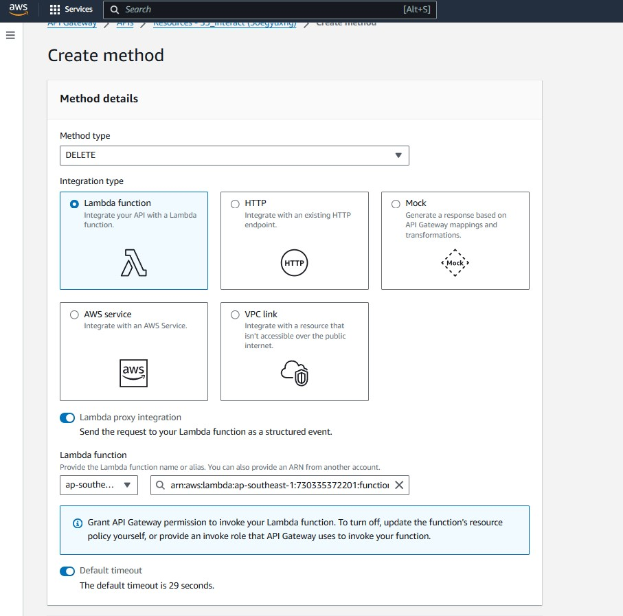
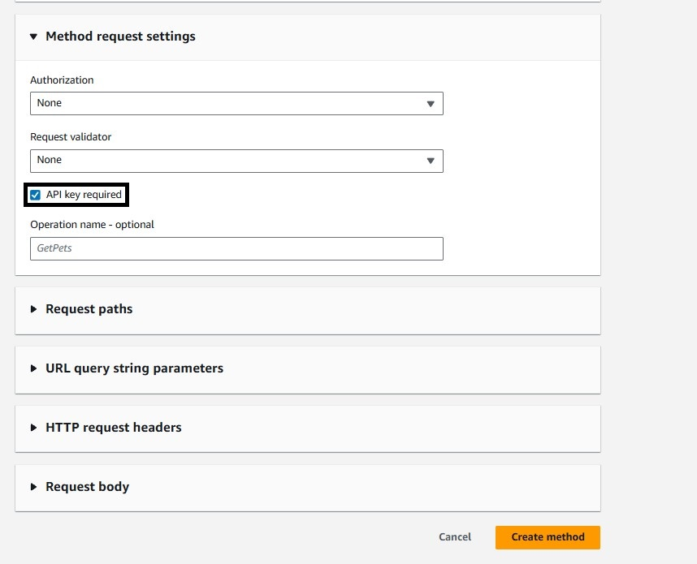
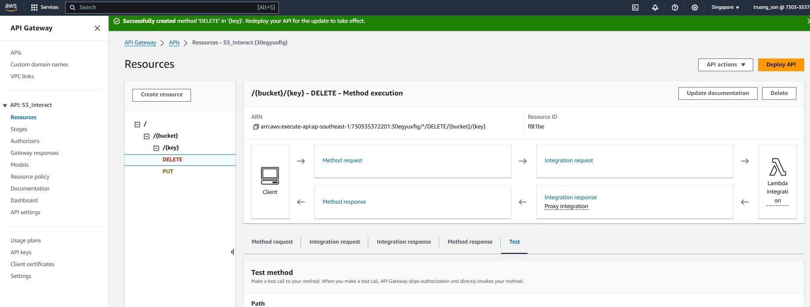
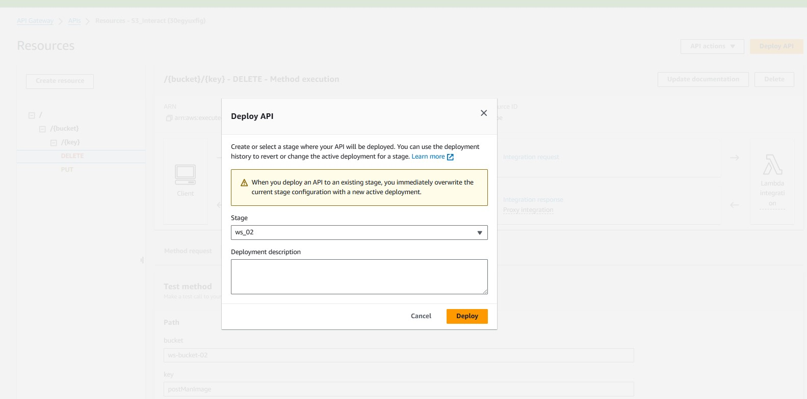
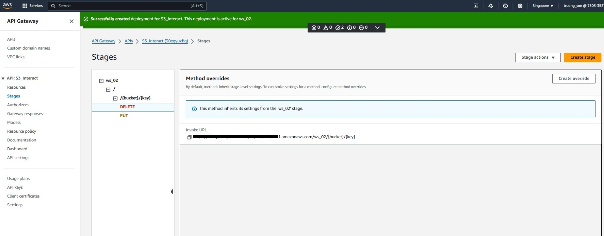

+++
title = "Create API Gateway"
date = 2024
weight = 3
chapter = false
pre = "<b>2.3. </b>"
+++

## Content

In this step, we will create an API Gateway. Specifically, one API will use S3 Integration to upload files to an S3 bucket, and another API will trigger the Lambda function created in the previous step to delete a specified file from the S3 bucket.

#### Create Upload API (PUT)

1. In the search bar, search for API Gateway and select it to go to the AWS API Gateway service page. Click **Create API**, select **REST API**, and then click **Build**.
   
2. Enter a name for the API, leave the other options as default, and click **Create API**.
   
3. You will be automatically redirected to the management page of the created API. Select '/' and then click **Create resource**.
   
4. Follow the steps as shown in the images below:
   
   
   
5. Click on '**/{key}**' and select **Create method**.
   
6. For file upload, select **PUT** for **Method type**, choose the appropriate **Region**, and select AWS Service as **Simple Storage Service (S3)**. Set **HTTP Method** to **PUT**.
   
7. Follow the steps shown in the images. For **Execution role**, create a Role similar to the IAM Role for Lambda but with AWS Service as API Gateway, and apply the corresponding policies. Then, paste the ARN of the IAM Role into the method.
   
8. Select **API key required** under **Method request settings** and then click **Create method**.
   
9. The method is created successfully. Click the **Integration request** tab and then select **Edit**.
   
10. In the **URL path parameters** section, **Add path parameter** as shown in the image. Then click **Save changes**.
    `Name: bucket, Mapped from: method.request.path.bucket (corresponds to parameters in the path).`
    `Name: filekey, Mapped from: method.request.path.key (corresponds to parameters in the path).`
    
11. Select **API settings** in the side panel, then click **Manage media types** to add binary media types that the API can receive.
    
12. Add the following **Binary media types** to interact with image files and save.
    
13. In the **Integration response** tab of the PUT method you just created, select **Edit**.
    
14. In the **Mapping templates** section, you can customize the API response. Here, configure the API to return the CloudFront path of the file if the upload is successful. Then save the changes.
    
15. Return to the page of the PUT method you created, select **Deploy API**.
16. Choose or create a new Stage and then click **Deploy**.
    {}
    A Stage is a snapshot for the API, such as api v1, api v2, etc.
    {}
    
17. After successful deployment, select **Stages** in the function panel, click on the corresponding API to view the API endpoint.
    
    Next, we will create an API Key and Usage plan for the API.
    {}
    **API key** is used for authentication when calling the API to prevent unauthorized access and misuse.
    **Usage plan** is used to limit behaviors like API spam calls and set limits on the number of concurrent requests to the API.
    {}
18. In the function panel, select API keys and then click **Create API key**.
19. Enter a name for the API key and save.
    
20. Copy the newly created API key.
    
21. In the **Usage plan** section, click **Create usage plan**.
22. Enter the desired configurations. **Rate**: Number of requests per second. **Burst**: Number of concurrent requests. **Requests**: Number of requests users can make in a time period (daily, monthly, etc.). Then click **Create usage plan**.
    
23. Return to **API keys**, select the API key you created, and click **Add to usage plan** to associate the API with the desired Usage plan.
    
24. In the **Associated stages** tab, click **Add stage** to add the deployed API to the Usage plan.
    
    

#### Create Delete API (DELETE)

1. In the **Resources** section of the function panel, select **Create method**.
2. Choose **Method type** as **DELETE**. Since this API triggers the Lambda function created earlier, configure it as shown below.
   
3. Then click **Create method**.
   
4. The Delete API has been created successfully.
   
5. Similarly, proceed to deploy the Delete API.
   
   

Thus, we have created the Upload and Delete APIs. Next, we will proceed to testing.
