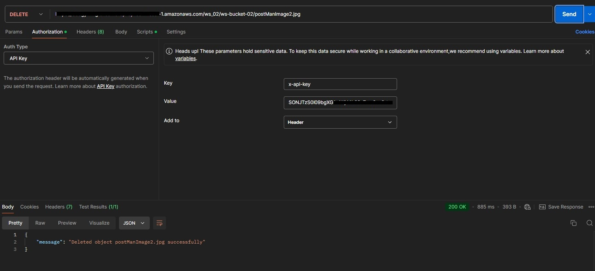
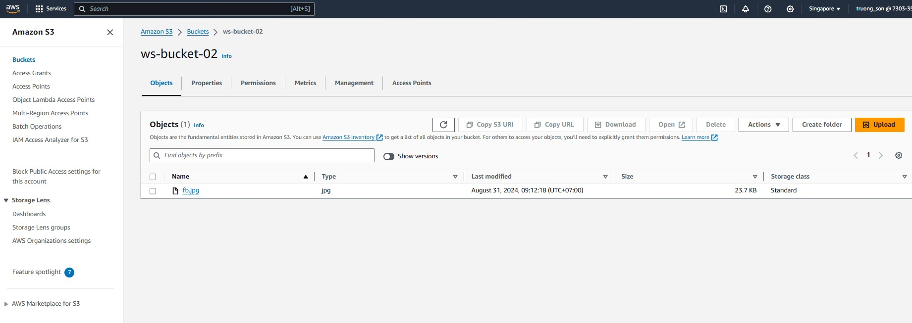

+++
title = "Test API with Postman"
date = 2024
weight = 3
chapter = false
pre = "<b>3. </b>"
+++

## Contents

In this final step, we will test the Upload and Delete APIs we created using Postman.

#### Test Upload API (PUT)

1. Select the PUT method, enter the Upload API URL (see the **Stages** section). In the body, choose the file to upload and then click **Send**.
   
   As we can see, the result will return Forbidden 403 because we haven't added an API key for authentication.
   
2. Now add the API key in the **Authorization** tab and click **Send** again.
   
   The result now matches the format we configured in the **Integration response** section, including the status and CloudFront URL of the uploaded file.
3. Click on the URL to view the image.
   
4. Go to S3 and you will see the image that was uploaded.
   

#### Test Delete API (DELETE)

1. Select the DELETE method, enter the Delete API URL (see the **Stages** section). In the body, choose the file you want to delete and then click **Send**.
   
   The result will return a message indicating that the deletion was successful.
2. Go to S3 and you will see that the file has been deleted.
   

We have completed creating a simple image storage solution.
